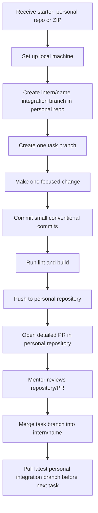

# Schedula — Frontend Internship Starter

Schedula is a practical Next.js starter for doctor appointment booking and clinic operations. It gives interns a small, typed codebase with a real UI, predictable data boundaries, and a contribution workflow that scales beyond a demo.

## Stack

- Next.js App Router, React, TypeScript, Tailwind CSS
- ESLint for static analysis
- A typed mock JSON endpoint at `GET /api/appointments`
- Node.js 20.9 or later

## Quick start

```bash
git clone https://github.com/PearlThoughts/frontend-internship.git
cd frontend-internship
npm install
npm run dev
```

Open [http://localhost:3000](http://localhost:3000).

| Command | Purpose |
| --- | --- |
| `npm run dev` | Start the local development server |
| `npm run lint` | Run static analysis |
| `npm run build` | Type-check and create a production build |
| `npm run start` | Serve the production build |

## Architecture

Keep every change inside the layer that owns it. Route files compose features; they should not contain feature state, API parsing, or large presentational trees.

```text
src/
  app/                         # Routes, layouts, metadata, route handlers
    api/                       # HTTP boundary only
  features/
    appointments/
      components/              # Feature UI (cards, forms, views)
      hooks/                   # Feature state and query hooks
      api/                     # Typed feature API client / mappers
      types.ts                 # Feature-only types
  components/
    ui/                        # Reusable headless primitives
    layout/                    # Shared app shell/navigation
  lib/
    mock-data/                 # API fixtures used only by mock handlers
    utils/                     # Small, generic pure helpers
  types/                       # Cross-feature domain contracts
```

### Dependency rules

- `app` may import from `features`, `components`, `lib`, and `types`.
- A `feature` may import shared `components`, `lib`, and `types`, but never another feature’s private files.
- `components/ui` must not fetch data or know appointment business rules.
- `lib/mock-data` is never imported directly by a page or visual component; route handlers expose it through HTTP.
- Promote a helper to `lib` only after it is genuinely shared by two or more features.

## Headless component structure

Create reusable UI primitives around behaviour and accessibility, then let the feature own its content and visual composition.

```tsx
// components/ui/dialog/dialog.tsx — reusable behaviour and semantics
<Dialog open={isOpen} onOpenChange={setIsOpen}>
  <Dialog.Trigger>Reschedule</Dialog.Trigger>
  <Dialog.Content aria-describedby="reschedule-help">
    <RescheduleAppointmentForm appointment={appointment} />
  </Dialog.Content>
</Dialog>
```

A headless `Dialog`, `Select`, `Tabs`, or `Popover` owns keyboard interactions, focus management, ARIA semantics, and state transitions. It does **not** own appointment copy, API calls, or page-specific layout. Prefer composition over boolean-heavy APIs such as `isBookingDialog`, `patientMode`, or `compactHeader`.

## Mock JSON API

The dashboard calls the API exactly as it would call a backend:

```text
Browser component → GET /api/appointments → route handler → mock fixture
```

- Contract type: `src/types/appointment.ts`
- Mock records: `src/lib/mock-data/appointments.ts`
- JSON endpoint: `src/app/api/appointments/route.ts`

When the backend is ready, retain the `Appointment` contract and replace the route handler or the feature API client. Do not scatter `fetch()` calls throughout cards, rows, and buttons. Keep response parsing, errors, and mapping in one API boundary.

Example typed client pattern:

```ts
export async function getAppointments(): Promise<Appointment[]> {
  const response = await fetch("/api/appointments");
  if (!response.ok) throw new Error("Unable to load appointments");
  const body: { data: Appointment[] } = await response.json();
  return body.data;
}
```

## Code-quality guardrails

### DRY, without premature abstraction

- Remove repeated business logic and duplicated API contracts.
- Do not create a generic component for a one-off screen. Repeatable behaviour is the signal to extract.
- Prefer configuration data and small pure helpers over copy-pasted conditionals.

### SOLID, applied to frontend work

| Principle | Schedula practice |
| --- | --- |
| Single responsibility | A `AppointmentCard` renders one appointment; a hook loads data; a route handler returns HTTP data. |
| Open/closed | Add a new status through a status map or variant, not by rewriting every card. |
| Liskov substitution | Components accept their declared contracts and work with every valid `Appointment`. |
| Interface segregation | Pass `onCancel` to the action that needs it—not a large page controller object. |
| Dependency inversion | UI depends on typed API functions/contracts, not directly on mock fixture files. |

Also keep components focused, use semantic HTML first, support keyboard use, provide loading/error/empty states, and test mobile layouts at 320px, 768px, 1024px, and 1440px.

## Intern workflow: local and personal repositories

`git pull` updates a repository that already exists on a machine. It cannot create the first local copy. The starter repository is distribution-only: interns are **not** collaborators on `PearlThoughts/frontend-internship`, and they must not create branches or PRs in it.

Each intern works in a personal repository or a company-provided local copy, then shares their own repository/PR with their mentor. This keeps the organisation starter clean while allowing many interns to work independently.

### Setup options

Use the option your mentor provides:

1. **Personal repository from the starter:** create a repository under the intern’s own GitHub account, copy the starter into it, then clone that personal repository locally.
2. **Starter ZIP:** download and extract the starter, run `git init`, create a personal remote repository, and push the initial copy there.
3. **Existing local project:** after the first setup only, use `git pull` to receive updates from the intern’s own remote or an approved upstream remote.

> A private organisation repository cannot be cloned, forked, or pulled by non-collaborators. If the starter must be directly accessible to all interns, the organisation must separately decide to make it public or distribute it as a ZIP/template.

### Personal repository and branch workflow



### Branch naming

| Branch | Format | Example |
| --- | --- | --- |
| Personal integration branch | `intern/<first-name>` | `intern/priya` |
| Feature task | `feat/<ticket>-<scope>-<slug>` | `feat/SCH-142-appointments-doctor-filter` |
| Bug fix | `fix/<ticket>-<scope>-<slug>` | `fix/SCH-157-booking-timezone` |
| Documentation | `docs/<ticket>-<slug>` | `docs/SCH-160-api-contract` |
| Chore/tooling | `chore/<ticket>-<slug>` | `chore/SCH-161-eslint-rules` |

Use lowercase kebab-case. Include the task/ticket ID when one exists. A task branch must describe one reviewable outcome; do not mix a styling cleanup, a feature, and a dependency upgrade.

### Commands after first local setup

Create the personal integration branch once in the intern’s **own** repository:

```bash
git switch -c intern/your-name
git push -u origin intern/your-name
```

Start every assigned task from the latest personal integration branch:

```bash
git switch intern/your-name
git pull --ff-only origin intern/your-name
git switch -c feat/SCH-142-appointments-doctor-filter
```

Commit focused increments as soon as each small logical unit is complete:

```bash
git add src/features/appointments
git commit -m "feat(appointments): add doctor filter"
git push -u origin feat/SCH-142-appointments-doctor-filter
```

### Keeping a local project current

After the initial setup, use this to update a checked-out branch from the intern’s own remote:

```bash
git switch intern/your-name
git pull --ff-only origin intern/your-name
```

If a mentor gives the intern an approved upstream remote, add it once and fetch updates without pushing to it:

```bash
git remote add upstream <approved-starter-url>
git fetch upstream
git merge upstream/<approved-branch>
```

Never push to the upstream starter repository unless the mentor has explicitly granted access.

### Commit standard

Make small, meaningful commits. A commit should be safe to review, revert, and describe in one sentence.

```text
feat(appointments): add doctor filter
fix(booking): preserve selected time on validation error
docs(readme): document task branch workflow
chore(tooling): align lint script
```

Do not create commits such as `update`, `changes`, `wip`, or a large “all work” commit. Avoid committing generated output, `.env` files, secrets, or unrelated formatting changes.

### Pull request checklist

Each task PR lives in the intern’s **personal** repository and targets `intern/your-name`. Include:

1. A concise problem and solution summary.
2. Screenshots or a short recording for visual changes.
3. API contract or mock-data changes, if any.
4. Verification results: `npm run lint` and `npm run build`.
5. Known limitations or follow-up work.
6. A link to the assigned ticket/task.

Only merge a task PR after review. Interns share the PR URL or their repository URL with the mentor; they do not open PRs against `PearlThoughts/frontend-internship` unless they are granted collaborator access.

## Before requesting review

- [ ] Branch name follows the documented convention.
- [ ] Change is scoped to one task and no unrelated files are included.
- [ ] UI has keyboard access and meaningful loading, error, and empty states.
- [ ] Mock/API contract remains typed and is not imported into visual components.
- [ ] `npm run lint` and `npm run build` pass.
- [ ] PR description, screenshots, and verification notes are complete.

## UI delivery checks

- Prefer small, focused components and typed boundaries.
- Use real loading, empty, and error states for data-driven UI.
- Design mobile-first; verify 320px, 768px, 1024px, and 1440px.
- Keep motion purposeful, fast, and respectful of reduced-motion preferences.